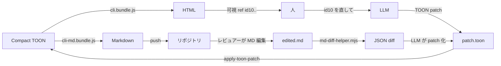

[English](./README.md) | **日本語**

# spechtml

> 短い Compact TOON を書けば、整った HTML / Markdown が出る。編集は patch、人と LLM の文書ループを丸ごと回す Claude Code プラグイン。

人が読む文書と LLM が扱うソースを同期させる Claude Code プラグイン。LLM が **Compact TOON** を書き、レンダラが **HTML / Markdown** を出し、編集は `target_hash` 付きの **TOON patch** で流れる。

```
Compact TOON  ──► HTML       (cli.bundle.js)
              ├─► Markdown   (cli-md.bundle.js)
              └◄─ TOON patch (apply-toon-patch.bundle.js)
```

---

## なぜ作ったか

| 症状 | 出典 |
|---|---|
| 1 行直したいだけなのにファイル全体が再生成される | [anthropics/claude-code #27896](https://github.com/anthropics/claude-code/issues/27896) |
| 1 行修正が 50 行 diff になる | [eyaltoledano/claude-task-master #913](https://github.com/eyaltoledano/claude-task-master/issues/913) |
| `Rest of the code remains the same` でファイルが破壊される | [cline/cline #14](https://github.com/saoudrizwan/claude-dev/issues/14) |
| 32 K 出力上限で途中切れ | [anthropics/claude-code #24055](https://github.com/anthropics/claude-code/issues/24055) |

`spechtml` の打ち手:

- **TOON が Source of Truth** — JSON より約 40 % 短い([toonformat.dev](https://toonformat.dev/))
- **HTML / Markdown はビュー** — 決定論的に再生成
- **編集は patch**(`replace` / `append` / `insert` / `remove` / `add_section`)
- **Markdown は TOON へ往復できる**(LLM 経由)

---

## 検証済み数値(3 ケース × 36 ops)

`dev/verification/` 配下で、3 種類の業務文書(REST API 仕様、製品 PRD、障害ポストモーテム)に対して計測。各ケースで 6 操作(`v0` 土台 + 5 編集 `E1..E5`)を 2 ルート(LLM 直接 HTML vs spechtml)で実行。

| 指標 | LLM 直接 HTML | spechtml v0.3.3 |
|---|---|---|
| 累計トークン(api-spec、6 op) | 17,886 | **8,322**(46.5 %) |
| 累計トークン(prd、6 op) | 19,842 | **8,722**(43.9 %) |
| 累計トークン(postmortem、6 op) | 18,564 | **9,054**(48.8 %) |
| 「新セクション追加」1 op の出力 | 1,394 トークン(HTML 全文) | **213 トークン**(`add_section` patch、約 85 % 減) |
| 「セル 1 個編集」1 op の出力 | 1,287 トークン | **125 トークン**(`replace` patch、約 90 % 減) |
| 再現性(同 source、2 回 render の hash 比較) | 確率的 | **18 / 18 完全一致** |
| Markdown round-trip diff | n/a | **4 / 4 golden sample で `diff` exit 0** |
| テストスイート | n/a | **73 / 73**(node:test) |

出典: `dev/verification/reports/metrics.compact.toon`(集計)、`plugin/skills/spechtml/examples/md-roundtrip*/`(検証済 golden sample)、`plugin/test/`(テスト)。

---

## 機能

- **Compact TOON で書く** — `reqs` / `decisions` / `components` / `steps` / `metrics` / `nodes`+`edges` / `prose` / `note` / `snippets` の名前付きブロック、`reqs[3|]{id|p|s|t|d}:` のようなヘッダ
- **決定論的な HTML / Markdown 出力** — 単一 HTML(可視 ref id・Mermaid 内包)と GFM Markdown
- **5 つの atomic patch op** — `replace` / `append` / `insert` / `remove` / `add_section`、`target_hash`(SHA-256)で stale 拒否
- **prose 内コードフェンス**(v0.3.2+)— triple-backtick が `<pre><code class="language-...">` に、他の Markdown は plain text
- **Markdown round-trip** — レビュアーが `.md` を編集 → LLM が差分から TOON patch を生成 → 適用 → 再 render
- **TOON SPEC v3 互換、fork なし** — `prose` は通常の string、公式 TOON decoder(TS / Python / Go / Rust / Java / .NET / PHP / Dart / Swift)で読める
- **サプライチェーン強化** — 依存 exact pin、esbuild bundle 同梱(plugin 配布時 `npm install` 不要)、pre-push lefthook が `audit / test / build` 並列実行

### prose-fence の例

```toon
prose: "実装はこんな感じ。\n\n```python\ndef hello():\n    print('hi')\n```"
```

ミニ「GET /hello」ドキュメントベンチで、prose-fence は同等コードを `snippets` ブロックで書いた場合より **57〜67 % 削減**、生 HTML より **約 32 % 削減**。

### 厳格 round-trip 手順

[`SKILL.md`](./plugin/skills/spechtml/SKILL.md) に 5 ステップ手順 + 失敗分岐を記載。検証済 golden sample 4 件は [`plugin/skills/spechtml/examples/md-roundtrip*/`](./plugin/skills/spechtml/examples/) にある。

---

## クイックスタート

```shell
# Claude Code 内で
/plugin marketplace add Takahir-O/spechtml
/plugin install spechtml@spechtml
```

そして Claude にこう頼む:

> Users API の仕様書を作って。GET /users(limit、cursor、role)と POST /users(email、name、role)。spechtml で。

Claude が `.toon` を書き、HTML を生成して、パスを教える。ブラウザで開く。編集したくなったら:

> id12 を初心者向けに書き直して

Claude が `id12` → TOON path を解決 → patch を出す → apply → 再 render。あなたはブラウザを更新するだけ。

---

## 仕組み



- 人はコマンドを叩かない。Claude が全スクリプトを実行する。
- HTML には可視 id(`id10`...)が埋まっているので、人は何でも口頭で参照できる。
- patch は最小サイズ — LLM は 100〜200 トークンを出すだけで、HTML 全文 1,000+ トークンを再 emit する必要がない。

---

## 動作確認済みサンプル

検証済 golden sample(`diff <after-edit.md> <rendered-after-patch.md>` で exit 0 になる):

| サンプル | 操作 | パス |
|---|---|---|
| プロセ文の編集(代表ケース) | `replace` | [`plugin/skills/spechtml/examples/md-roundtrip/`](./plugin/skills/spechtml/examples/md-roundtrip/) |
| 表に行を追加 | `append` | [`md-roundtrip-structural/01-row-add/`](./plugin/skills/spechtml/examples/md-roundtrip-structural/01-row-add/) |
| 表から行を削除 | `remove` | [`md-roundtrip-structural/02-row-remove/`](./plugin/skills/spechtml/examples/md-roundtrip-structural/02-row-remove/) |
| 新セクションを追加 | `add_section` | [`md-roundtrip-structural/03-section-add/`](./plugin/skills/spechtml/examples/md-roundtrip-structural/03-section-add/) |

各ディレクトリに before / after / patch / 再 render の各ファイルと `README.md` がある。

---

## 更新履歴(主要点)

### v0.3.3(現在)

- HTML 出力を note 風ライトテーマに刷新([awesome-design-md-jp / design-md/note](https://github.com/kzhrknt/awesome-design-md-jp/tree/main/design-md/note) 準拠)。本文 `18px / line-height 2.0`、見出しに `letter-spacing: 0.04em` + `font-feature-settings: "palt"`、本文側は `letter-spacing: normal` で note の Don't を順守
- `runtime/render/document.js` で Google Fonts(`Noto Sans JP` / `Open Sans`)を読み込み。Windows でも Meiryo に落ちず note 本家と同じレンダリングに揃う
- 追加トークン: `--brand`(note green `#5ac8b8`)、`--serif`、`--elevation-1/4/6`(ambient + key の dual shadow)、`--main-w 940px`、`--article-w 620px`。本文流の幅は 620px、main は 940px、card は `--elevation-1` + radius 12px
- Mermaid `themeVariables` も note トークンに整列(`primaryTextColor` / `primaryBorderColor: #08131a`, `lineColor: #5a656b`)
- TOON 入力スキーマ・patch op・CLI には変更なし。Markdown 出力にも影響なし

### v0.3.2

- `renderProseText`: prose 内 triple-backtick fence を `<pre><code>` に変換(HTML)、Markdown ではフェンスがそのまま素通し
- `md-diff-helper.mjs`: round-trip 用の LCS ベース MD-diff 抽出器(`${CLAUDE_SKILL_DIR}/scripts/md-diff-helper.mjs` で呼べる)
- 4 件の検証済 Markdown round-trip golden sample(prose 1 + 構造変更 3)
- `SKILL.md` に厳格手順を追記(トリガーフレーズ + 5 ステップ + 失敗分岐 + 再現性保証)

### v0.3.1

- `insert` op(配列の指定 index に挿入)
- `add_section` op(top-level section + `order` 更新を 1 op で)
- `validate-toon` が tabular row count mismatch で `line_content` + `diagnosis` を返すように
- `apply-toon-patch` の path resolver が「もしかして "..." ?」を返すように

### v0.3.0

- 初期リリース、9 種ブロック対応のレンダラ、`replace` / `append` / `remove` patch、Mermaid + 可視 id 入りの単一 HTML 出力

詳細は [CHANGELOG.md](./CHANGELOG.md) を参照。

---

## リポジトリ構成

```
.
├── .claude-plugin/
│   └── marketplace.json    # マーケットプレイス目録(リポジトリルート必須)
├── plugin/                 # /plugin install で配布される全て
│   ├── .claude-plugin/plugin.json
│   ├── skills/spechtml/
│   │   ├── SKILL.md
│   │   ├── runtime/        # ソース + dist/ bundle
│   │   ├── references/
│   │   ├── scripts/        # md-diff-helper.mjs(v0.3.2+)
│   │   └── examples/       # md-roundtrip/、md-roundtrip-structural/
│   ├── README.md / README.ja.md
│   └── LICENSE
├── package.json            # 開発スクリプト(build, test, lefthook, render shortcut)
├── package-lock.json
├── build.mjs               # runtime/dist/*.bundle.js を生成する esbuild 設定
├── lefthook.yml            # pre-push の npm audit / test / build
├── .nvmrc                  # Node 24(Active LTS)
├── .editorconfig
├── CHANGELOG.md
├── SECURITY.md
├── README.md / README.ja.md
└── LICENSE
```

ローカル限定の `dev/` ワークスペースは git 管理外で、個人ドラフト・生成テスト出力・検証ハーネスを置く。配布プラグインには含まれない。

---

## ローカル動作確認

```bash
claude --plugin-dir ./plugin
```

`plugin/` 配下を変更したら、Claude Code 内で `/reload-plugins` を実行すれば再起動なしで反映される。

## ローカル開発

```bash
npm install                 # 開発依存のインストール + lefthook hook 登録
npm run build               # runtime/dist/*.bundle.js を再生成(runtime ソース変更後に必須)
npm test                    # plugin/test/ の node:test スイート
npm run audit:root          # 本番依存の脆弱性監査
```

検証ハーネス(3 ケース × 36 ops)は `dev/verification/` 配下にあり、git 管理外。`dev/verification/README.md` の手順でローカル再現できる。

---

## ライセンス

MIT — [LICENSE](./LICENSE) を参照。
