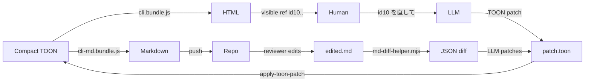

**English** | [日本語](./README.ja.md)

# spechtml

> Compact TOON in, beautiful HTML and Markdown out — with patch-based editing for the human ↔ LLM document loop.

A Claude Code plugin that keeps human-facing documents and LLM-facing source in sync. LLMs author **Compact TOON**; the renderer produces **HTML** or **Markdown**; edits flow as **TOON patches** with `target_hash` verification.

```
Compact TOON  ──► HTML       (cli.bundle.js)
              ├─► Markdown   (cli-md.bundle.js)
              └◄─ TOON patch (apply-toon-patch.bundle.js)
```

---

## Why?

| Symptom | Reference |
|---|---|
| Output explodes — the model re-emits the whole file | [anthropics/claude-code #27896](https://github.com/anthropics/claude-code/issues/27896) |
| 1-line edits become 50-line diffs | [eyaltoledano/claude-task-master #913](https://github.com/eyaltoledano/claude-task-master/issues/913) |
| `Rest of the code remains the same` comments shred the file | [cline/cline #14](https://github.com/saoudrizwan/claude-dev/issues/14) |
| Output truncation at 32 K | [anthropics/claude-code #24055](https://github.com/anthropics/claude-code/issues/24055) |

`spechtml` breaks this pattern:

- **TOON is the source of truth** — ~40 % shorter than JSON ([toonformat.dev](https://toonformat.dev/))
- **HTML / Markdown are views** — regenerated deterministically
- **Edits are patches** (`replace` / `append` / `insert` / `remove` / `add_section`)
- **Markdown can round-trip back to TOON** via the LLM

---

## Verified numbers (3 cases × 36 ops)

Measured under `dev/verification/` against three real-world document genres (REST API spec, product PRD, incident postmortem). Each case ran six operations (`v0` brief + five edits `E1..E5`) on two routes (LLM-direct HTML vs. spechtml).

| Metric | LLM-direct HTML | spechtml v0.3.3 |
|---|---|---|
| Cumulative tokens (api-spec, 6 ops) | 17,886 | **8,322** (46.5 %) |
| Cumulative tokens (prd, 6 ops) | 19,842 | **8,722** (43.9 %) |
| Cumulative tokens (postmortem, 6 ops) | 18,564 | **9,054** (48.8 %) |
| Output per "add new section" edit | 1,394 tokens (full HTML) | **213 tokens** (`add_section` patch, ~85 % less) |
| Output per "edit one cell" edit | 1,287 tokens | **125 tokens** (`replace` patch, ~90 % less) |
| Reproducibility (same source, two renders) | non-deterministic | **18 / 18 hash-identical** |
| Markdown round-trip diff | n/a | **4 / 4 golden samples, `diff` exit 0** |
| Test suite | n/a | **73 / 73** Node `node:test` |

Sources: `dev/verification/reports/metrics.compact.toon` (raw aggregate), `plugin/skills/spechtml/examples/md-roundtrip*/` (verified golden samples), `plugin/test/` (test suite).

---

## Features

- **Compact TOON authoring** — named blocks (`reqs` `decisions` `components` `steps` `metrics` `nodes`+`edges` `prose` `note` `snippets`) with headers like `reqs[3|]{id|p|s|t|d}:`
- **Deterministic HTML / Markdown render** — single self-contained HTML with visible ref ids (`id10`, ...) and Mermaid; GFM Markdown for repo sharing
- **5 atomic patch ops** — `replace` / `append` / `insert` / `remove` / `add_section`, each with `target_hash` (SHA-256) stale-patch rejection
- **Code fences inside `prose`** (v0.3.2+) — triple-backtick blocks render as `<pre><code class="language-...">`; other Markdown stays plain text
- **Markdown round-trip** — `cli-md.bundle.js` for sharing, reviewer edits the `.md`, LLM produces a TOON patch from the diff, applier verifies and updates
- **TOON SPEC v3 compatible, no fork** — `prose` is a plain string; readable by any official TOON decoder (TS / Python / Go / Rust / Java / .NET / PHP / Dart / Swift)
- **Supply-chain hardened** — exact-pinned deps, esbuild bundles distributed (no `npm install` at install time), pre-push lefthook runs `audit / test / build` in parallel

### `prose`-fence example

```toon
prose: "Implement like this:\n\n```python\ndef hello():\n    print('hi')\n```"
```

In the "GET /hello" mini-doc benchmark, `prose`-fence cuts tokens **57–67 %** vs. `snippets` for the same code, **~32 %** vs. raw HTML.

### Strict round-trip procedure

[`SKILL.md`](./plugin/skills/spechtml/SKILL.md) ships a 5-step procedure with failure branches. Four verified golden samples live in [`plugin/skills/spechtml/examples/md-roundtrip*/`](./plugin/skills/spechtml/examples/).

---

## Quick Start

```shell
# In Claude Code
/plugin marketplace add Takahir-O/spechtml
/plugin install spechtml@spechtml
```

Then ask Claude:

> Create a Users API spec with GET /users (limit, cursor, role queries) and POST /users (email, name, role). Use spechtml.

Claude writes a `.toon` file, renders it to HTML, and tells you the path. Open the HTML in a browser. To edit, just say:

> id12 を初心者向けに書き直して

Claude resolves `id12` → TOON path → emits a patch → applies → re-renders. You refresh.

---

## How It Works



- The human never runs commands. Claude executes every script.
- The HTML carries visible ids (`id10`, ...) so the human can refer to anything verbally.
- Patches are minimal — the LLM emits 100–200 tokens instead of re-flowing 1,000+ tokens of HTML.

---

## Examples

Verified golden samples (run `diff <after-edit.md> <rendered-after-patch.md>` and watch exit 0):

| Sample | Operation | Path |
|---|---|---|
| Prose-text edit (the canonical case) | `replace` | [`plugin/skills/spechtml/examples/md-roundtrip/`](./plugin/skills/spechtml/examples/md-roundtrip/) |
| Add a row to a table | `append` | [`md-roundtrip-structural/01-row-add/`](./plugin/skills/spechtml/examples/md-roundtrip-structural/01-row-add/) |
| Remove a row from a table | `remove` | [`md-roundtrip-structural/02-row-remove/`](./plugin/skills/spechtml/examples/md-roundtrip-structural/02-row-remove/) |
| Add a brand-new section | `add_section` | [`md-roundtrip-structural/03-section-add/`](./plugin/skills/spechtml/examples/md-roundtrip-structural/03-section-add/) |

Each directory contains the before / after / patch / re-rendered files plus a `README.md` describing the round-trip.

---

## What's new

### v0.3.3 (current)

- HTML output adopts a note-inspired light theme (color, typography, spacing) per [awesome-design-md-jp / design-md/note](https://github.com/kzhrknt/awesome-design-md-jp/tree/main/design-md/note). Body type is `18px / line-height 2.0`; headings carry `letter-spacing: 0.04em` + `font-feature-settings: "palt"`; body keeps `letter-spacing: normal` per note's Don'ts
- `runtime/render/document.js` injects Google Fonts (`Noto Sans JP`, `Open Sans`) so Windows reproduces the note rendering instead of falling back to Meiryo
- New design tokens: `--brand` (note green `#5ac8b8`), `--serif`, `--elevation-1/4/6` (dual-shadow), `--main-w 940px`, `--article-w 620px`. Article-flow widths constrained to 620px; cards use `--elevation-1` with a 12px radius
- Mermaid `themeVariables` aligned to note tokens (`primaryTextColor` / `primaryBorderColor: #08131a`, `lineColor: #5a656b`)
- No changes to TOON input schema, patch ops, or CLI surface; Markdown output is unchanged

### v0.3.2

- `renderProseText`: triple-backtick fences inside `prose` render as `<pre><code>` (HTML) and pass through Markdown unchanged
- `md-diff-helper.mjs`: LCS-based MD-diff extractor for the round-trip workflow (callable as `${CLAUDE_SKILL_DIR}/scripts/md-diff-helper.mjs`)
- 4 verified Markdown round-trip golden samples (1 prose-text, 3 structural)
- Strict procedure documented in `SKILL.md` with trigger phrases, 5 numbered steps, and a reproducibility guarantee

### v0.3.1

- `insert` patch op (insert a row at a given index)
- `add_section` patch op (add a top-level section + update `order` atomically)
- `validate-toon` returns `line_content` and `diagnosis` for tabular row-count mismatches
- `apply-toon-patch` path resolver suggests a similar key (`Did you mean "..."?`)

### v0.3.0

- Initial public release, the 5-block-types renderer, `replace` / `append` / `remove` patches, single-file HTML output with Mermaid + visible ids

See [CHANGELOG.md](./CHANGELOG.md) for the full record.

---

## Repository layout

```
.
├── .claude-plugin/
│   └── marketplace.json    # marketplace catalog (root must contain this)
├── plugin/                 # everything that ships with /plugin install
│   ├── .claude-plugin/plugin.json
│   ├── skills/spechtml/
│   │   ├── SKILL.md
│   │   ├── runtime/        # source + dist/ bundles
│   │   ├── references/
│   │   ├── scripts/        # md-diff-helper.mjs (v0.3.2+)
│   │   └── examples/       # md-roundtrip/, md-roundtrip-structural/
│   ├── README.md / README.ja.md
│   └── LICENSE
├── package.json            # development scripts (build, test, lefthook, render shortcuts)
├── package-lock.json
├── build.mjs               # esbuild bundle generator for runtime/dist/*.bundle.js
├── lefthook.yml            # pre-push npm audit / test / build
├── .nvmrc                  # Node 24 (Active LTS)
├── .editorconfig
├── CHANGELOG.md
├── SECURITY.md
├── README.md / README.ja.md
└── LICENSE
```

A local-only `dev/` workspace exists outside git for personal drafts, generated test output, and the verification harness. It is not part of the distributable plugin.

---

## Local plugin testing

```bash
claude --plugin-dir ./plugin
```

After changing files in `plugin/`, run `/reload-plugins` inside Claude Code to apply changes without restarting.

## Local development

```bash
npm install                 # installs dev deps + registers lefthook hooks
npm run build               # rebuild runtime/dist/*.bundle.js (run after editing runtime sources)
npm test                    # node:test suite under plugin/test/
npm run audit:root          # audit production dependencies
```

The verification harness (3 cases × 36 ops) lives under `dev/verification/` (gitignored). Recreate it locally with the steps in `dev/verification/README.md`.

---

## License

MIT — see [LICENSE](./LICENSE).
